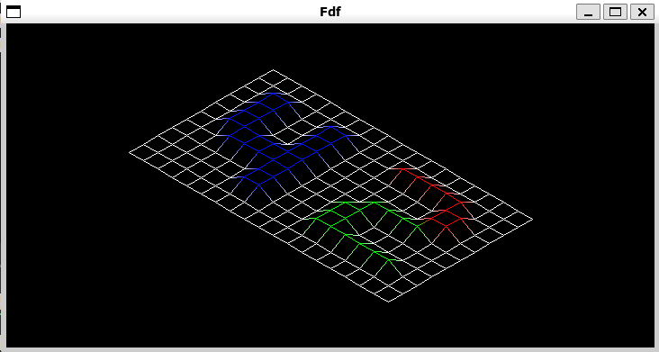

# Fdf

## Description

This project is about creating a simplified graphic “wireframe” (“fils de fer” in French,
hence the name of the project) representation of a relief landscape linking various points
(x, y, z) via segments. The coordinates of this landscape are stored in a file passed as
a parameter to your program.

<p align="center">
  
</p>
  
## Getting Started

### Dependencies

* [MinilibX](https://github.com/42Paris/minilibx-linux)
* X11

### Installing

```
git clone https://github.com/VincentGerard/Fdf
make
```

### Executing program

* ./fdf [filename]
* Ex: ./fdf maps/42.fdf
```
make run
```

## Help

Mlx.h and X11.h not found means the dependencies are not properly insalled!

If Minilibx is missing some dependencies:
```
sudo apt-get update && sudo apt-get install xorg libxext-dev zlib1g-dev libbsd-dev
```

## Acknowledgments

* [Documentation](https://harm-smits.github.io/42docs/libs/minilibx/getting_started.html)
